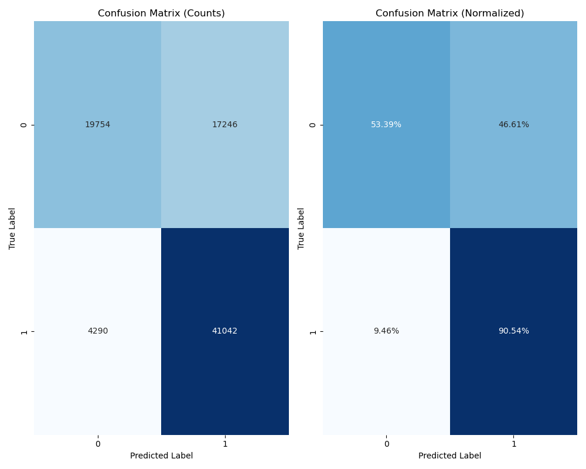
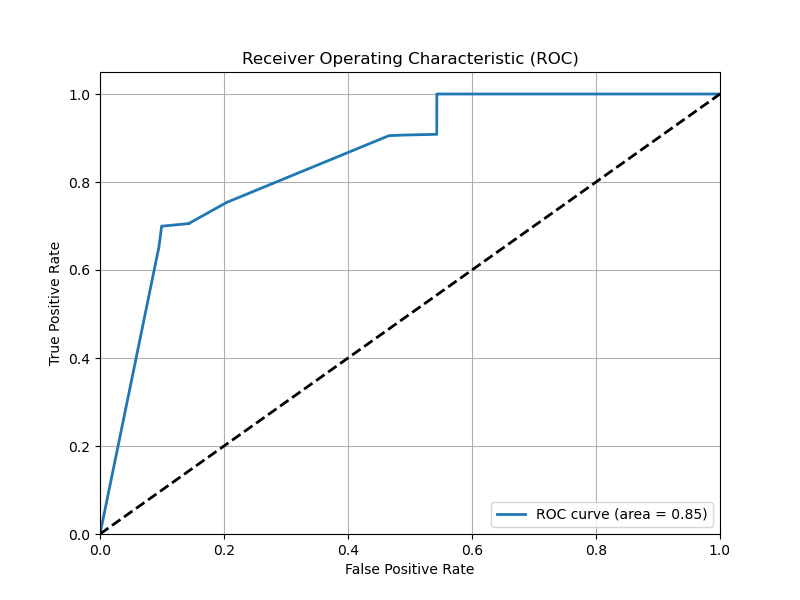
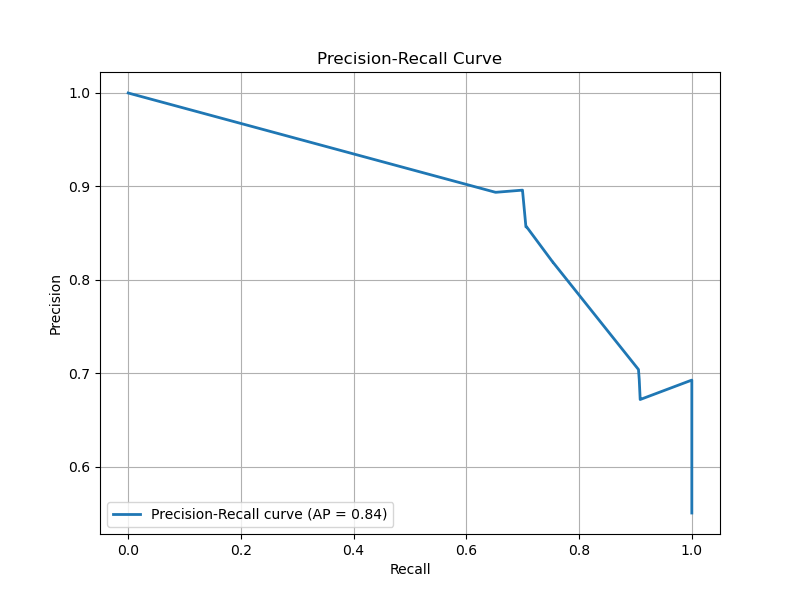
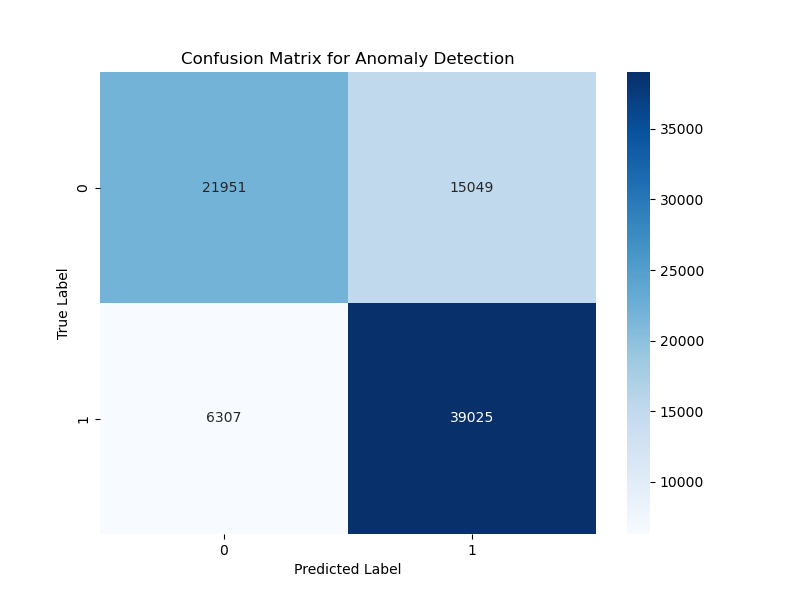

# Genetic Programming Anomaly Detection

This project implements a Genetic Programming-based anomaly detection system for network traffic using the UNSW-NB15 dataset.

## Methodology

The core approach employs Genetic Programming (GP) using the gplearn library. Key components include:

- **GP Algorithm**: Population-based evolution with fitness evaluation, tournament selection, subtree crossover, and point mutation operators.
- **Fitness Function**: Binary classification fitness using log loss to optimize anomaly detection performance.
- **Feature Engineering**: Preprocessing pipeline with scikit-learn for categorical encoding, scaling, and imputation on network traffic features.
- **Thresholding**: Optimal probability threshold determination using precision-recall curve analysis for anomaly classification.

## Technologies Used

- **Python**: Core programming language
- **gplearn**: Genetic Programming library for symbolic regression and classification
- **scikit-learn**: Machine learning library for preprocessing and evaluation metrics
- **pandas & numpy**: Data manipulation and numerical computing
- **matplotlib & seaborn**: Data visualization and plotting

## Features

- Trains GP models on network traffic data for anomaly detection
- Evaluates model performance using accuracy, F1-score, ROC-AUC, and precision-recall metrics
- Provides standalone anomaly detection function with configurable probability threshold
- Generates visualizations including confusion matrix, ROC curve, and feature importance plots
- Supports preprocessing of categorical and numerical features from UNSW-NB15 dataset

## Quick Start

Clone the repository, install dependencies, and train the model:

```bash
git clone https://github.com/0ALI0ZARGAR0/genetic-programming.git
cd genetic_programming
pip install gplearn scikit-learn pandas numpy matplotlib seaborn

# Train the enhanced model
python src/GP.py

# Or train the simplified model
python src/GP_simple.py

# Use the trained anomaly detector
python src/anomaly_detector.py
```

## Results

### Performance Metrics

<div align="center">

|                 Confusion Matrix                  |              ROC Curve              |
| :-----------------------------------------------: | :---------------------------------: |
|  |  |

|                    Precision-Recall Curve                     |                          Anomaly Detection Confusion Matrix                           |
| :-----------------------------------------------------------: | :-----------------------------------------------------------------------------------: |
|  |  |

</div>

## Project Structure

```
genetic_programming/
├── src/
│   ├── GP.py              # Enhanced GP model with comprehensive features
│   ├── GP_simple.py       # Simplified GP model for quick training
│   └── anomaly_detector.py # Standalone anomaly detection function
├── data/
│   └── UNSW_NB15/         # UNSW-NB15 dataset files
├── models/                # Trained model files
├── results/               # Evaluation results and visualizations
└── README.md
```

## Model Files

- `gp_anomaly_detector_enhanced.pkl`: Enhanced GP model with comprehensive preprocessing
- `gp_anomaly_detector_enhanced_preprocessor.pkl`: Preprocessing pipeline for enhanced model
- `gp_anomaly_detector.pkl`: Simplified GP model

## Usage Examples

### Training Models

```python
# Enhanced model with comprehensive features
exec(open('src/GP.py').read())

# Simplified model for quick training
exec(open('src/GP_simple.py').read())
```

### Anomaly Detection

```python
from src.anomaly_detector import detect_anomaly

# Example network traffic features
sample = {
   'dur': 0.121478,
   'proto': 'tcp',
   # Add all required features here
}

is_anomaly, probability = detect_anomaly(sample)
print(f"Anomaly detected: {is_anomaly}, Probability: {probability:.4f}")
```
